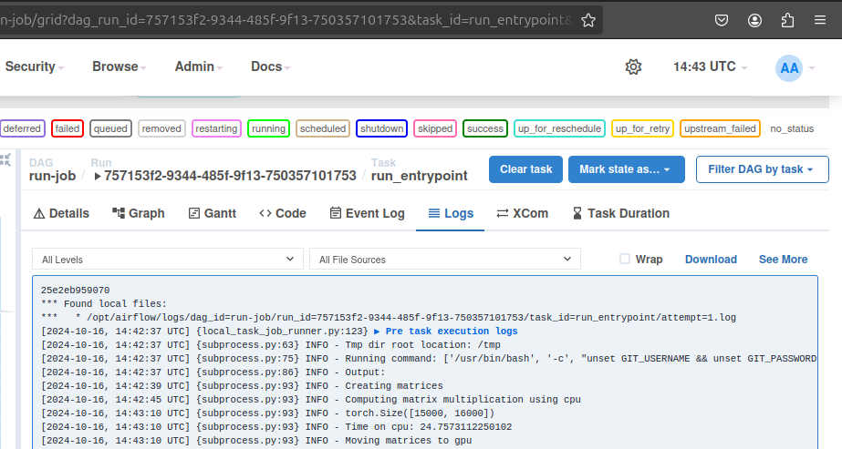

# Remote job runner.

This repo contains a basic Airflow setup to listen at a SQS queue,
and launch jobs as specified in the queue message.


The message body is a json object
```
{
  "repo_uri": ...
  "branch": ...
  "entrypoint": ...
  "entrypoint_params": ...
}
```
specifying a git repository, a branch, an entrypoint and a string
passed as an environment variable, in order to pass parameters to
the entrypoint.


The output of the job (and logs for each stage involved in the process)
as well as stats about execution time, failed jobs, etc. can be found in the
logs via the Airflow Web UI.



An "add-only" copy of repos is kept so that only changes are retrieved
when the repo/branch is modified. Temporary copies of the repos are
created for each job execution, so that they can use the repo freely.

The setup is aimed at having several workers, so that by imposing
restrictions on them one can, for instance, assign each job to a different
GPU.

See the section on Security below for assumptions of the setup
for this aspect.

## Normal usage

For starting the service, simply type, in the airflow subdirectory
```
./launch_airflow.sh
```
in case the provided `terraform` configuration was used to create
the queue.

If the queue was created somehow else,
```
./launch_airflow.sh <QUEUE URL> <QUEUE REGION>
```
makes the service use your queue. The queue must be a "fifo" one.

## Setup instructions

### Tools needed

- Terraform and AWS CLI if creating the queue with setup provided
  (those are not needed for an existing queue).
- Docker, including the docker compose plugin.
- nvidia-container-toolkit (this page has the relevant
[instructions](https://docs.nvidia.com/datacenter/cloud-native/container-toolkit/latest/install-guide.html)).

### User setup

- To create the queue, make sure the aws cli has proper credentials (for instance,
  with `aws configure`) and then in the directory terraform:
  ```
  terraform init
  terraform apply
  ```
  You might want to save/commit the `terraform.tfstate` file so that
  you can later run `terraform destroy` if you want to delete the queue.

- In the directory airflow, copy `env_example` to `.env`, set up git
  and aws credentials there accordingly.

- In docker-compose.yaml look for the container airflow-worker-0 and
  add more containers of the same kind, setting the device id accordingly
  for each of them.

- Allow the user that owns the process in the Airflow container to write
to the logs and the repo storage. That user must be in the root group,
which is not a security issue (some of the related aspects are discussed
[here](https://github.com/puckel/docker-airflow/issues/509). These commands
```
sudo chgrp -R 0 airflow/proj_dir/logs/ repos/ temp_repos/
sudo chmod -R g+rwX airflow/proj_dir/logs/ repos/ temp_repos/
```
serve the purpose, when run at the root of the repo.

- At point running `./launch_airflow.sh` or
`./launch_airflow <QUEUE URL> <QUEUE REGION>` (if the queue wasn't
created with the step above) will launch the service, including
a web interface. After a while (logs can be explored with
`docker compose logs` to check when servers are up) navigating
to `localhost:8080/`, and logging in with username and password
"airflow" will show the list of DAGs available (Airflow executions
are specified via Directed Acyclic Graphs).

- The DAGs need to be turned on in the UI before the carry out any work.

## DAGs provided

- The main DAG is `run-job`. One can launch a job (regardless of any queue)
just by click the "Play button" and inputting the repo, branch, entrypoint
and parameters manually. This DAG is (more often) triggered by another DAG
that senses the AWS queue and triggers the job according to the message.
- The job polling the queue is `sqs-listen-for-job-requests`.
- For testing/debugging purposes, one can use `send-test-message` to send a
message to the queue with the right format.

## System administration

Administration can be performed as normal for docker compose, using commands like
`docker compose logs`, `docker compose down`, etc.

The script `launch_airflow.sh` just sets some environment variables before calling
`docker compose up`. Docker compose reads those via the .env file. If those variables
are put directly in the .env file, or set somehow else, then just
`docker compose up` is enough to get the service running.

## Testing

The setup provided is mostly configuration and "wiring" between different components.
It's unlikely that there are any corners cases where things fail for particular cases.

The DAG `send-test-message` can be used to check that the setup can communicate
with the queue, that `sqs-listen-for-job-requests` can then pickup the message
and that `run-job` is triggered and runs a job accordingly.

While it might seem like a "self high-five", by sending that message the whole circuit
`Airflow-Send-Message -> SQS -> Airflow-Read-Message -> Airflow-Run-Job` is
tested.

The default spec for `send-test-message` executes a simple program that
multiplies two big matrices using both cpu and gpu, timing the multiplications.

## Security

This setup is intended for use of code and infrastructure within a single
organisation, meaning that users and developers don't behave adversarially towards
each other or the infrastructure.

Running arbitrary code, from anyone on the internet, is obviously a endeavour that
must be carried out with extreme care about malicious behaviour.

While this setup uses infrastructure from the cloud, it is assumed that the organisation
controls the queue, the host where the service runs, and the code repositories
that are executed.
